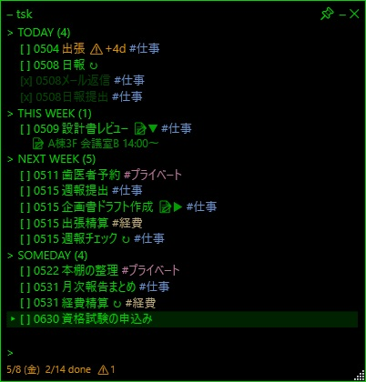
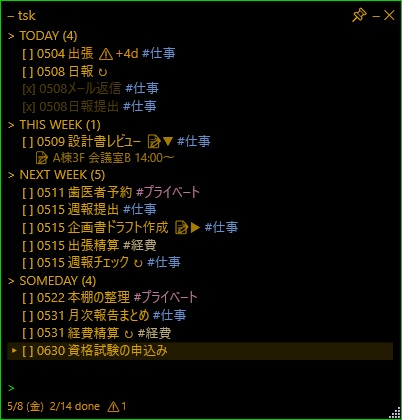
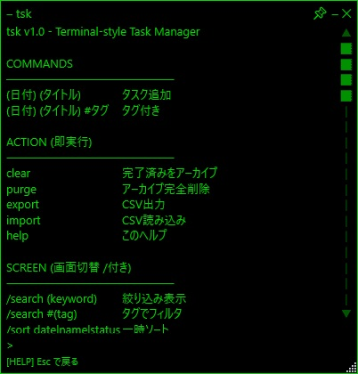

# tsk - Terminal-style Task Manager

黒背景×緑文字のハッカー風UIで、キーボードだけで高速にタスク管理できるツール

👉 **3秒で登録、1秒で完了**

---

## 🎬 登録デモ

## 🎬 View機能

---

## 🚀 ダウンロード

👉 https://github.com/moritan777/tsk-releases/releases/latest

※ zipを展開して `tsk.exe` を実行するだけ

---

## ■ 特徴

- 🖥 ターミナル風UI（黒背景×緑文字）
- ⌨ キーボード中心の高速操作
- 📂 4カテゴリ自動管理（TODAY / THIS WEEK / NEXT WEEK / SOMEDAY）
- 📅 日付の自然入力
- 🔄 繰り返しタスク
- 🏷 タグ機能
- 📝 メモ機能

---

## 🧩 v1.1 新機能

### View機能

タスクを用途ごとに分離できる
👉 `V1〜V9` で瞬時に切り替え
---

## ⚡ 使い方（最短）

Ctrl + Alt + T → 起動
↓
金 レビュー #仕事 → Enter
↓
↓キー → Spaceで完了
👉 マウス不要
---

## 📸 スクリーンショット

| Green テーマ | Amber テーマ | ヘルプ画面 |
|---|---|---|
|  |  |  |

---

## 💡 こんな人向け

- キーボード操作が好き
- 軽いタスク管理ツールが欲しい
- ターミナルっぽいUIが好き

---

## 🛠 技術

- C# / WPF (.NET 9)
- SQLite
- self-contained（.NET不要）

---

## ⭐ サポート

気に入ったら **GitHubで⭐** もらえると嬉しいです 🙏

---

## 📩 作者

Mitsukida

## ✍️ 解説記事（Zenn）

- UIの作り方
- 設計でハマった話
- WPFの罠まとめ

👉 https://zenn.dev/mitsukida

## 💰ご支援について

tsk を気に入っていただけましたら、開発継続のためご支援いただけると大変励みになります。

Amazon ギフト券（Eメールタイプ）でのご支援を受け付けております。
- 送り先：mmitsuki0806@gmail.com
- 受取人名：mitsukida
- 金額：お気持ちで結構です

## 📩作者

mitsukida (mmitsuki0806@gmail.com)

## ライセンス

フリーソフト（寄付歓迎）。詳細は同梱の readme.txt を参照してください。
